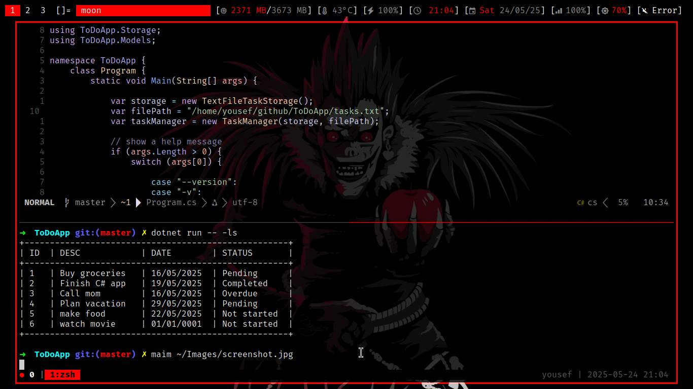

# ✅ ToDoApp – Application Console de Gestion de Tâches

Bienvenue sur **ToDoApp**, une application console minimaliste développée en **C#** 💻. Elle permet de **gérer vos tâches facilement** depuis le terminal, en utilisant une architecture claire, modulaire et orientée objet.

---

## ✨ Fonctionnalités

- 📋 Ajouter une tâche avec description + date
- 🗑️ Supprimer une tâche par ID
- 👀 Lister toutes les tâches avec affichage formaté
- ⌛ Détection automatique des tâches en retard ou terminées
- 💾 Stockage persistant dans un fichier `tasks.txt`

---

## 🏗️ Architecture technique

Le projet suit les bonnes pratiques de conception logicielle :

- ✅ **Programmation Orientée Objet (OOP)**
- 🔌 **Injection de dépendance** entre les composants
- 🔄 **Interface `ITaskStorage`** pour abstraire la persistance
- 🧱 Séparation claire : logique métier / modèles / persistance

### 📂 Structure du projet

```bash
.
├── Core
│   └── TaskManager.cs           # Logique métier : ajout, suppression, listing
├── Models
│   └── ToDoTask.cs              # Modèle de données d'une tâche
├── Program.cs                   # Point d'entrée : interprète les arguments CLI
├── README.md                    # Documentation du projet 📘
├── Storage
│   ├── ITaskStorage.cs          # Interface pour abstraire le stockage
│   └── TextFileTaskStorage.cs   # Implémentation avec fichier texte
├── tasks.txt                    # Fichier de stockage des tâches
└── ToDoApp.csproj               # Fichier de configuration du projet .NET
````

---

## ⚙️ Commandes CLI

Exécute l'application avec :

```bash
dotnet run -- [option] [arguments]
```

| Commande                     | Description                               |
| ---------------------------- | ----------------------------------------- |
| `--version` ou `-v`          | 📌 Affiche la version de l'application    |
| `--list-tasks` ou `-ls`      | 📋 Affiche toutes les tâches existantes   |
| `--add-task "<desc>" <date>` | ➕ Ajoute une nouvelle tâche              |
| `--delete <id>`              | ❌ Supprime une tâche par son identifiant |

### 🧪 Exemples

```bash
dotnet run -- --add-task "Réviser C#" 25/05/2025
dotnet run -- --list-tasks
dotnet run -- --delete 2
```

---

## 📊 Exemple d'affichage

```text
+----------------------------------------------------+
| ID  | DESC             | DATE       | STATUS       |
+----------------------------------------------------+
| 1   | Réviser C#       | 25/05/2025 | Pending      |
| 2   | Faire les courses| 20/05/2025 | Completed    |
+----------------------------------------------------+
```

---



---

## 🧠 Technologies utilisées

* ⚙️ **Langage :** C#
* 🧩 **Framework :** .NET
* 🛠️ **Concepts :**

  * Interfaces (`ITaskStorage`)
  * Injection de dépendances
  * Architecture modulaire
  * Manipulation de fichiers en C#

---

## 📚 Bonnes pratiques appliquées

* ✅ **Séparation des responsabilités**
* 🧪 **Code testable et maintenable**
* 📦 **Architecture extensible** (ex. stockage futur dans DB)
* 👨‍💻 Code propre et commenté

---

## 👤 Auteur

**🧑‍💻 Xorcist15**
Étudiant en informatique à Colmar – Passionné par le développement logiciel et les systèmes Unix/Linux.
🔗 [GitHub](https://github.com/Xorcist15)

---

## 📝 Licence

Ce projet est distribué sous la licence **MIT**.
Libre à toi de l'utiliser, modifier, ou contribuer !

---
